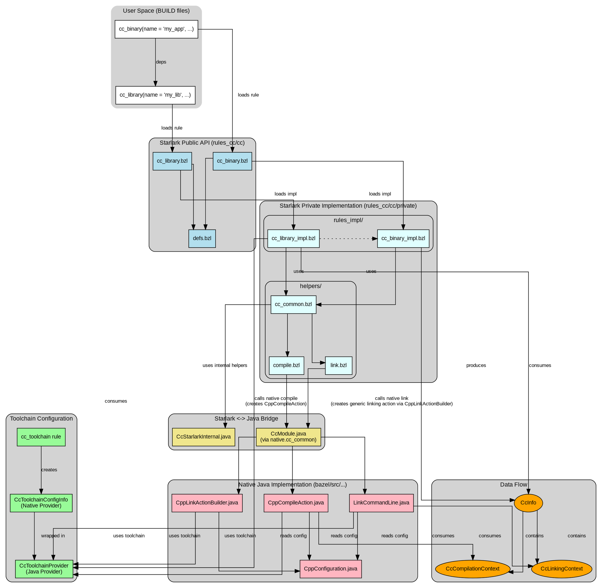

# C++ Rules in Blaze/Bazel: Architecture Overview

This document provides a detailed overview of the architecture of the C++ rules in Blaze and Bazel, focusing on the interactions and dependencies between the different components.

## Architecture Diagram

The following diagram illustrates the overall architecture of the C++ rules.

## Starlark Implementation ([`rules_cc`](https://github.com/bazelbuild/rules_cc))

This directory contains the primary, user-facing Starlark implementation of the C++ rules. The core logic is implemented here, leveraging a native Java implementation for operations that haven't yet been moved to Starlark.

### Core Rule Definition

The public API of the C++ rules is defined in the `cc/` subdirectory. These files serve as the entry points for users of the C++ rules and are responsible for loading and exposing the underlying implementation.

*   **[`cc/defs.bzl`](https://github.com/bazelbuild/rules_cc/blob/main/cc/defs.bzl)**: This file acts as a central hub, exporting the main user-facing rules like `cc_library`, `cc_binary`, and `cc_test`, as well as key providers such as `CcInfo` and `CcToolchainConfigInfo`. This simplifies the `load` statements for users and provides a single point of entry to the C++ ruleset.

*   **[`cc/cc_library.bzl`](https://github.com/bazelbuild/rules_cc/blob/main/cc/cc_library.bzl), [`cc/cc_binary.bzl`](https://github.com/bazelbuild/rules_cc/blob/main/cc/cc_binary.bzl), [`cc/cc_test.bzl`](https://github.com/bazelbuild/rules_cc/blob/main/cc/cc_test.bzl), [`cc/cc_import.bzl`](https://github.com/bazelbuild/rules_cc/blob/main/cc/cc_import.bzl)**: These files are wrappers that load their respective implementations from the [`cc/private/rules_impl/`](https://github.com/bazelbuild/rules_cc/tree/main/cc/private/rules_impl/) directory. This separation of interface from implementation is a key architectural principle of the C++ rules, allowing the internal logic to be refactored without affecting user-facing BUILD files.

### Core Rule Implementation

The [`cc/private/rules_impl/`](https://github.com/bazelbuild/rules_cc/tree/main/cc/private/rules_impl/) directory contains the core logic for the C++ rules. A key aspect of this implementation is the flow of information between rules via providers, most notably the `CcInfo` provider.

*   **`CcInfo` Provider**: This provider is the primary data structure for communicating C++-specific information between rules. It encapsulates the compilation context (headers, defines, etc.) and the linking context (libraries, link flags, etc.).

*   **[`cc/private/rules_impl/cc_library.bzl`](https://github.com/bazelbuild/rules_cc/blob/main/cc/private/rules_impl/cc_library.bzl)**: This rule is a producer of `CcInfo`. It orchestrates several key steps:
    *   **Toolchain Resolution**: It uses `find_cc_toolchain` to determine and acquire the appropriate C++ toolchain for the current build platform.
    *   **Feature Configuration**: It configures specific C++ features based on both the selected toolchain and attributes provided by the user in the BUILD file.
    *   **Compilation**: It invokes `cc_common.compile` to process source files and generate object files.
    *   **Linking**: It uses `cc_common.create_linking_context_from_compilation_outputs` to link the compiled object files into either a static or dynamic library.
    *   **Provider Creation**: Finally, it packages the compilation and linking information into a `CcInfo` provider. This provider is crucial as it's then consumed by other dependent rules in the build graph, propagating essential C++ build data.

*   **[`cc/private/rules_impl/cc_binary.bzl`](https://github.com/bazelbuild/rules_cc/blob/main/cc/private/rules_impl/cc_binary.bzl) and [`cc/private/rules_impl/cc_test.bzl`](https://github.com/bazelbuild/rules_cc/blob/main/cc/private/rules_impl/cc_test.bzl)**: These rules are consumers of `CcInfo`. They perform the final linking step to create an executable. Their process involves:
    *   **Compilation**: Compiling their own `srcs` using `cc_common.compile`.
    *   **Dependency Aggregation**: Collecting and merging the `CcInfo` providers from their entire transitive dependency graph.
    *   **Linking**: Using the aggregated linking context from all dependencies, they call `cc_common.link` to invoke the linker and produce the final executable.
    *   **Runfiles Creation**: They are responsible for assembling the `runfiles` necessary for the executable to run, which includes shared libraries from the linking contexts of its dependencies.
    *   **`cc_test`** builds directly on `cc_binary`, inheriting all of its logic. It adds test-specific functionality, such as integrating with test runners (via a `test_runner_toolchain_type`), setting up test environments, and instrumenting for code coverage.

*   **[`cc/private/rules_impl/cc_import.bzl`](https://github.com/bazelbuild/rules_cc/blob/main/cc/private/rules_impl/cc_import.bzl)**: This rule acts as an adapter for pre-compiled libraries. It doesn't compile code but instead:
    *   **Wraps Artifacts**: Takes user-provided library files (`.a`, `.so`, etc.).
    *   **Creates `CcInfo`**: It constructs a `CcInfo` provider from scratch. It uses `cc_common.create_library_to_link` to wrap the library files into a `CcLinkingContext` and `cc_common.compile` (with no sources) to create a `CcCompilationContext` for the provided headers.
    *   **Provides a Standard Interface**: By providing a standard `CcInfo`, it makes the pre-compiled library indistinguishable from a source-built `cc_library` to any consuming rules.

### Implementation Details (`cc/private`)

The [`cc/private/`](https://github.com/bazelbuild/rules_cc/tree/main/cc/private) directory is where the bulk of the Starlark implementation logic resides. It is further subdivided to modularize the complex processes of compilation and linking. The main entry point to this internal API is [`cc/private/cc_common.bzl`](https://github.com/bazelbuild/rules_cc/blob/main/cc/private/cc_common.bzl), which aggregates and exposes functions from the subdirectories.

*   **[`cc/private/compile/`](https://github.com/bazelbuild/rules_cc/tree/main/cc/private/compile/)**: This directory encapsulates the logic for compiling C++ source files.
    *   **[`compile.bzl`](https://github.com/bazelbuild/rules_cc/blob/main/cc/private/compile/compile.bzl)**: Defines the `compile` function, which is the heart of this module. It is responsible for creating `CppCompileAction` instances for each source file. It takes a rich set of parameters, including sources, headers, compiler flags, and toolchain information, and orchestrates the call into the native `CppCompileAction` constructor via `CcModule`.

*   **[`cc/private/link/`](https://github.com/bazelbuild/rules_cc/tree/main/cc/private/link/)**: This directory encapsulates the logic for linking C++ objects into executables and libraries.
    *   **[`link.bzl`](https://github.com/bazelbuild/rules_cc/blob/main/cc/private/link/link.bzl)**: Defines the `link` function. This function is responsible for orchestrating the creation of generic linking actions (via CppLinkActionBuilder.java and CcModule). It gathers all the necessary inputs, including object files from `CcCompilationContext` and libraries from `CcLinkingContext`, and constructs the final linker command line based on the toolchain configuration.

This modular structure, with `cc/common/cc_common.bzl` acting as a facade for the `cc/private` implementation, allows the core rule implementations in `rules_impl/` to be clean and declarative, focusing on what to compile and link, while the `compile/` and `link/` modules handle the complex details of how those actions are actually generated.

### Toolchain Configuration

The C++ toolchain is highly configurable and is defined through a set of interconnected Starlark rules in the [`cc/toolchains/`](https://github.com/bazelbuild/rules_cc/tree/main/cc/toolchains) directory. This architecture allows for a flexible and extensible toolchain that can be adapted to different platforms and compilers. The components are designed in a hierarchical and interdependent manner. The ultimate output of this Starlark configuration is the native `CcToolchainConfigInfo` provider, which acts as the bridge to Bazel's core C++ logic.

*   **`cc_toolchain`**: This is the top-level rule that defines a C++ toolchain and acts as the central aggregator. It is the target that build rules look for to get the `CcToolchainProvider`. It brings together all the other components of the toolchain: the tools, the flags, and the features. Internally, it uses [`cc_toolchain_config_lib.bzl`](https://github.com/bazelbuild/rules_cc/blob/main/cc/cc_toolchain_config_lib.bzl) to process its dependencies and construct the final `CcToolchainConfigInfo` provider.

*   **`cc_tool_map`**: This rule is a dependency of `cc_toolchain` and is responsible for mapping specific toolchain actions (e.g., `cpp_compile`) to the corresponding tools (e.g., the `clang` binary). This provides a layer of indirection, decoupling the logical action from the physical tool that executes it.

*   **`cc_feature` and `cc_args`**: These rules provide a powerful, conditional system for constructing the command lines for the tools.
    *   **`cc_args`** define a list of command-line flags and associate them with one or more actions (e.g., `cpp_compile`, `cpp_link_executable`).
    *   **`cc_feature`**s group a set of `cc_args` under a logical name (e.g., `opt` or `dbg`). These features can be enabled or disabled dynamically based on user flags (like `--copt`) or target attributes (`features=["opt"]`).
    *   The `cc_toolchain` rule defines the universe of available features and a baseline set of unconditional `cc_args`. When an action (like compiling a file) is executed, Bazel determines which features are active and assembles the final command line by combining the baseline `cc_args` with the `cc_args` from all active features that apply to that action. This hierarchical and conditional structure allows for a high degree of modularity and reusability in the toolchain configuration.

*   **`CcToolchainConfigInfo` Provider**: This native provider, now implemented as a wrapper around a StarlarkInfo instance, is the final product of the Starlark toolchain rules. It encapsulates the entire toolchain configuration, including action configs, features, and artifact naming patterns, in a format that the native C++ actions can understand. This provider is the crucial link that makes the flexible Starlark toolchain definition model compatible with Bazel's core C++ implementation.

## Native Java Implementation

The native Java part of the C++ rules provides the underlying functionality that is not yet migrated to Starlark.

### Key Java Classes

*   **[`CppConfiguration.java`](https://github.com/bazelbuild/bazel/blob/master/src/main/java/com/google/devtools/build/lib/rules/cpp/CppConfiguration.java)**: This class is a `Fragment` of the `BuildConfigurationValue` and represents the central hub for all C++ specific build settings. It holds the values of command-line options like `--copt`, `--linkopt`, `--compilation_mode`, and FDO settings. Starlark rules access this information through the `ctx.fragments.cpp` field. `CppCompileAction` uses this class to configure its command lines and behavior.

*   **[`CcToolchainProvider.java`](https://github.com/bazelbuild/bazel/blob/master/src/main/java/com/google/devtools/build/lib/rules/cpp/CcToolchainProvider.java)**: This is the Java representation of the selected C++ toolchain. It's a wrapper around a Starlark provider that is created by the `cc_toolchain` rule. It provides access to the tool paths, compiler features, and other toolchain-specific information that is needed to generate compile and link actions. It is a critical dependency for `CppCompileAction`.

*   **[`CcCompilationContext.java`](https://github.com/bazelbuild/bazel/blob/master/src/main/java/com/google/devtools/build/lib/rules/cpp/CcCompilationContext.java)**: This class is the Java counterpart to the `compilation_context` field of the `CcInfo` provider. It is an immutable data structure that aggregates all the information needed for C++ compilation that is collected from a target and its dependencies. This includes the headers, defines, and include directories. It's the primary data structure that flows "up" the dependency chain.

*   **[`LinkCommandLine.java`](https://github.com/bazelbuild/bazel/blob/master/src/main/java/com/google/devtools/build/lib/rules/cpp/LinkCommandLine.java)**: This class is responsible for constructing the complete command-line arguments for the linker. It uses the `FeatureConfiguration` (from `CcToolchainProvider`) and `CcToolchainVariables` to determine the correct tool path, flags, and environment variables. The output of this class is a `CommandLine` object that is then used to create a generic `CommandAction` or `SpawnAction`.

*   **Linking Action (via [`CppLinkActionBuilder.java`](https://github.com/bazelbuild/bazel/blob/master/src/main/java/com/google/devtools/build/lib/rules/cpp/CppLinkActionBuilder.java) and generic actions)**: Unlike compilation, there isn't a distinct `CppLinkAction.java` class. Instead, the linking action is a generic `CommandAction` or `SpawnAction` (core Bazel action types) that is configured by the [`CppLinkActionBuilder.java`](https://github.com/bazelbuild/bazel/blob/master/src/main/java/com/google/devtools/build/lib/rules/cpp/CppLinkActionBuilder.java) and executed using the [`LinkCommandLine.java`](https://github.com/bazelbuild/bazel/blob/master/src/main/java/com/google/devtools/build/lib/rules/cpp/LinkCommandLine.java). The [`CppLinkActionBuilder`](https://github.com/bazelbuild/bazel/blob/master/src/main/java/com/google/devtools/build/lib/rules/cpp/CppLinkActionBuilder.java) acts as a fluent API for setting up all parameters necessary for a linking operation, which then culminates in the registration of a generic command-line execution action with the Bazel engine. This approach emphasizes flexibility and reuse of core Bazel action mechanisms.

### Core C++ Rules ([`bazel/src/main/java/com/google/devtools/build/lib/rules/cpp/`](https://github.com/bazelbuild/bazel/tree/master/src/main/java/com/google/devtools/build/lib/rules/cpp))

This directory contains the core Java implementation of the C++ rules.

*   **[`CppRuleClasses.java`](https://github.com/bazelbuild/bazel/blob/master/src/main/java/com/google/devtools/build/lib/rules/cpp/CppRuleClasses.java)**: This file defines a set of string constants for various C++ features. These constants are used in the Starlark implementation to enable or disable specific toolchain features, providing a bridge between the high-level feature configuration and the low-level implementation.

*   **[`CcModule.java`](https://github.com/bazelbuild/bazel/blob/master/src/main/java/com/google/devtools/build/lib/rules/cpp/CcModule.java)**: This class is a key component of the bridge between Starlark and Java. It implements the `CcModuleApi` and exposes a set of C++-specific functions to the Starlark environment. These functions provide access to the underlying C++ toolchain and allow the Starlark rules to perform actions like compiling and linking. Access to this module is restricted to `cc_common.bzl`, ensuring that it is only used as intended by the C++ rules implementation.

*   **[`CppCompileAction.java`](https://github.com/bazelbuild/bazel/blob/master/src/main/java/com/google/devtools/build/lib/rules/cpp/CppCompileAction.java)**: This is the core Java class that represents the action of compiling a single C++ source file. It is a subclass of `AbstractAction` and contains all the information required to run the compiler, including the source file, output file, compiler options, and the set of input files. The Starlark implementation creates `CppCompileAction` instances through the `cc_common.compile` function, which calls into the native `CcModule`. During the execution phase, the Bazel execution engine will execute the `CppCompileAction`, which in turn invokes the compiler.

### Starlark C++ API ([`bazel/src/main/java/com/google/devtools/build/lib/starlarkbuildapi/cpp/`](https://github.com/bazelbuild/bazel/tree/master/src/main/java/com/google/devtools/build/lib/starlarkbuildapi/cpp))

This directory defines the formal Starlark API for the C++ rules, creating a well-defined interface between the Java and Starlark layers.

*   **[`CcInfoApi.java`](https://github.com/bazelbuild/bazel/blob/master/src/main/java/com/google/devtools/build/lib/starlarkbuildapi/cpp/CcInfoApi.java)**: This interface defines the Starlark representation of the `CcInfo` provider. It specifies the fields that are accessible from Starlark (e.g., `compilation_context`, `linking_context`) and the constructor for creating `CcInfo` objects. This provides a type-safe way for Starlark rules to interact with the `CcInfo` provider, which is a fundamental part of the C++ rules architecture.

*   **[`CcStarlarkInternal.java`](https://github.com/bazelbuild/bazel/blob/master/src/main/java/com/google/devtools/build/lib/rules/cpp/CcStarlarkInternal.java)**: This class exposes C++ compilation and linking helper functions to Starlark. These are APIs that are not considered part of the public Starlark API for C++ rules, but are necessary for the implementation of the C++ rules in `rules_cc`. This allows the `rules_cc` implementation to evolve without being constrained by the public API, while still providing a stable and well-defined interface to external users.
